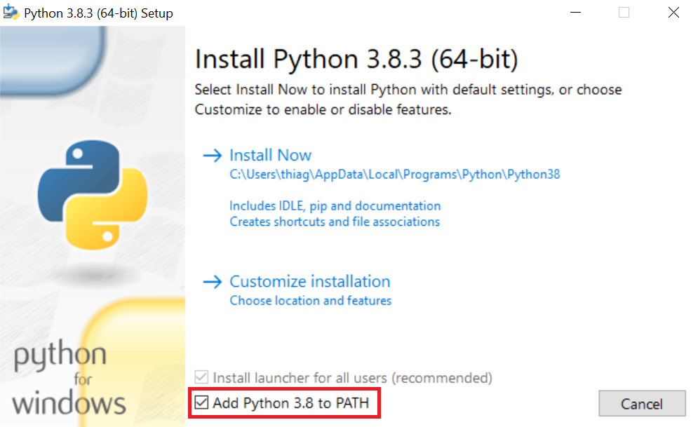

IRPF Investidor
===============

|PyPI| |Status| |Python Version| |License|

|Read the Docs| |Tests| |Codecov|

|pre-commit| |Black|

.. |PyPI| image:: https://img.shields.io/pypi/v/irpf-investidor.svg
   :target: https://pypi.org/project/irpf-investidor/
   :alt: PyPI
.. |Status| image:: https://img.shields.io/pypi/status/irpf-investidor.svg
   :target: https://pypi.org/project/irpf-investidor/
   :alt: Status
.. |Python Version| image:: https://img.shields.io/pypi/pyversions/irpf-investidor
   :target: https://pypi.org/project/irpf-investidor
   :alt: Python Version
.. |License| image:: https://img.shields.io/pypi/l/irpf-investidor
   :target: https://opensource.org/licenses/MIT
   :alt: License
.. |Read the Docs| image:: https://img.shields.io/readthedocs/irpf-investidor/latest.svg?label=Read%20the%20Docs
   :target: https://irpf-investidor.readthedocs.io/
   :alt: Read the documentation at https://irpf-investidor.readthedocs.io/
.. |Tests| image:: https://github.com/staticdev/irpf-investidor/workflows/Tests/badge.svg
   :target: https://github.com/staticdev/irpf-investidor/actions?workflow=Tests
   :alt: Tests
.. |Codecov| image:: https://codecov.io/gh/staticdev/irpf-investidor/branch/main/graph/badge.svg
   :target: https://codecov.io/gh/staticdev/irpf-investidor
   :alt: Codecov
.. |pre-commit| image:: https://img.shields.io/badge/pre--commit-enabled-brightgreen?logo=pre-commit&logoColor=white
   :target: https://github.com/pre-commit/pre-commit
   :alt: pre-commit
.. |Black| image:: https://img.shields.io/badge/code%20style-black-000000.svg
   :target: https://github.com/psf/black
   :alt: Black

Programa auxiliar para calcular custos de ações, ETFs e FIIs. Este programa foi feito para calcular emolumentos, taxa de liquidação e custo total para a declaração de Bens e Direitos do Imposto de Renda Pessoa Física.

**Essa aplicação foi testada e configurada para calcular tarifas referentes aos anos de 2019 a 2021 (IRPF 2020/2022) e não faz cálculos para compra e venda no mesmo dia (Day Trade), contratos futuros e Índice Brasil 50.**

Requisitos
----------

1. Python

Instale na sua máquina o Python 3.9.0 ou superior (versão 3.11 recomendada) para o seu sistema operacional em python.org_.

Usuários do Windows devem baixar a versão `Windows x86-64 executable installer` e na tela de instalação marcar a opção `Add Python 3.9 to PATH`:

2. Suporte a língua Português (Brasil) no seu sistema operacional.

Pode ser instalado no Linux (Debian/Ubuntu) pelo comando:

.. code:: console

   $ apt-get install language-pack-pt-base

Instalação
----------

You can install *IRPF Investidor* via pip_ from PyPI_:

.. code:: console

   $ pip install irpf-investidor

Uso
---

1. Entre na `Área do Investidor`_ da B3, faça login e entre no menu Extratos e Informativos → Negociação de Ativos → Escolha uma corretora e as datas 1 de Janeiro e 31 de Dezembro do ano em que deseja declarar. Em seguida clique no botão “Exportar para EXCEL”. Ele irá baixar o arquivo “InfoCEI.xls”.

**Ainda não é possível rodar o programa usando os novos arquivos XLSX, gerar no formato antigo.**

Você pode combinar lançamentos de anos diferentes em um mesmo documento colando as linhas de um relatório em outro, mas mantenha a ordem cronológica.

2. Execute o programa através do comando:

.. code:: console

   $ irpf-investidor

O programa irá procurar o arquivo "InfoCEI.xls" na pasta atual (digite `pwd` no terminal para sabe qual é) ou na pasta downloads e exibirá na tela os resultados.

Ao executar, o programa pede para selecionar operações realizadas em leilão. Essa informação não pode ser obtida nos relatórios da `Área do Investidor` da B3 e precisam ser buscadas diretamente com a sua corretora de valores. Isso afeta o cálculo dos emolumentos e do custo médio.

Aviso legal (disclaimer)
------------------------

Esta é uma ferramenta com código aberto e gratuita, com licença MIT. Você pode alterar o código e distribuir, usar comercialmente como bem entender. Contribuições são muito bem vindas. Toda a responsabilidade de conferência dos valores e do envio dessas informações à Receita Federal é do usuário. Os desenvolvedores e colaboradores desse programa não se responsabilizam por quaisquer incorreções nos cálculos e lançamentos gerados.

Créditos
--------

Esse projeto foi gerado pelo template `@cjolowicz`_'s `Hypermodern Python Cookiecutter`_.

.. _@cjolowicz: https://github.com/cjolowicz
.. _python.org: https://www.python.org/downloads/
.. _Área do Investidor: https://www.investidor.b3.com.br/
.. _Hypermodern Python Cookiecutter: https://github.com/cjolowicz/cookiecutter-hypermodern-python
.. _PyPI: https://pypi.org/
.. _pip: https://pip.pypa.io/
.. github-only
.. _Contributor Guide: CONTRIBUTING.rst
.. _Uso: https://irpf-investidor.readthedocs.io/en/latest/usage.html
